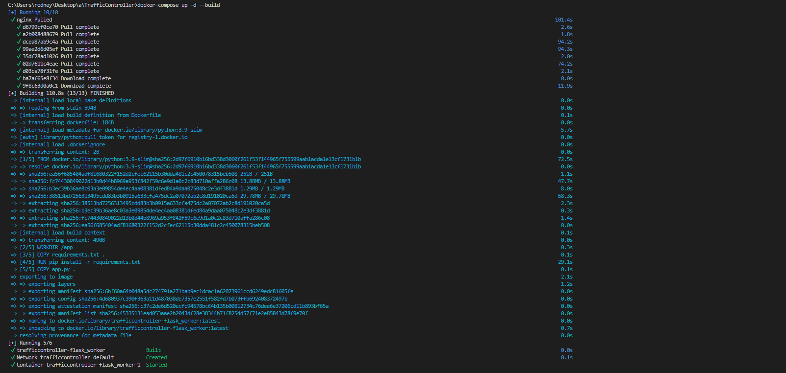
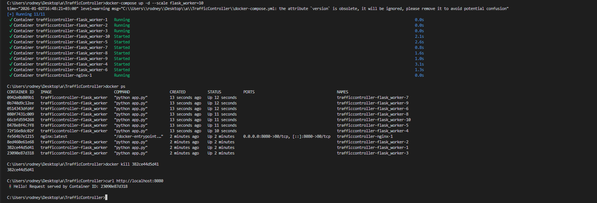

 🚦 TrafficController - Load Balancer

 
 

  

 📖 Project Overview
A production-grade Load Balanced Architecture demonstrating how Nginx distributes incoming HTTP traffic across multiple Python Flask application replicas using the Round-Robin algorithm.

 🏗️ Architecture
- Load Balancer: Nginx (configured as a Reverse Proxy)
- Workers: Python Flask API (3 replicas by default)
- Orchestration: Docker Compose
- Network: Internal Docker network with only Nginx exposed

 ✨ Key Features
- ⚡ Dynamic Scaling: Scale from 3 to 10+ workers instantly
- 🛡️ Fault Tolerance: Nginx automatically routes traffic away from failed containers
- 🔒 Network Isolation: Workers operate in a private network; only Nginx is publicly accessible
- 🔄 Round-Robin Distribution: Even distribution of requests across all healthy workers
- 📦 Containerized: Fully containerized setup for consistent environments

 🚀 Getting Started

 Prerequisites
- Docker Desktop installed and running
- Docker Compose (included with Docker Desktop)

 Installation & Running

1. Clone the repository:
   ```bash
   git clone https://github.com/fytroy/TrafficController.docker.git
   cd TrafficController.docker
   ```

2. Start the cluster:
   ```bash
   docker-compose up -d --build
   ```

3. Test the load balancer:
   ```bash
    Run multiple times to see different Container IDs
   curl http://localhost:8080
   ```
   
   Expected output (Container ID will change with each request):
   ```
   🚦 Hello! Request served by Container ID: abc123def456
   ```

4. Scale workers dynamically:
   ```bash
    Scale up to 10 workers
   docker-compose up -d --scale flask_worker=10
   
    Scale down to 5 workers
   docker-compose up -d --scale flask_worker=5
   ```

5. View running containers:
   ```bash
   docker-compose ps
   ```

6. View logs:
   ```bash
    All services
   docker-compose logs -f
   
    Specific service
   docker-compose logs -f nginx
   docker-compose logs -f flask_worker
   ```

7. Stop the cluster:
   ```bash
   docker-compose down
   ```

 📁 Project Structure
```
TrafficController/
├── app.py               Flask application code
├── requirements.txt     Python dependencies
├── Dockerfile           Flask worker container definition
├── nginx.conf           Nginx reverse proxy configuration
├── docker-compose.yml   Multi-container orchestration
└── README.md           This file
```

 🔧 Configuration

 Port Configuration
- External Port: 8080 (mapped to Nginx)
- Internal Port: 80 (Nginx)
- Flask Workers: 5000 (not exposed externally)

 Worker Replicas
Modify in [docker-compose.yml](docker-compose.yml):
```yaml
deploy:
  replicas: 3   Change this number
```

 🐛 Troubleshooting

 Docker Desktop Not Running
If you see `error during connect: ... pipe/dockerDesktopLinuxEngine: The system cannot find the file specified`:
- Ensure Docker Desktop is running
- Wait for Docker to fully start (check system tray icon)

 Port Already in Use
If port 8080 is already in use, modify the port mapping in [docker-compose.yml](docker-compose.yml):
```yaml
ports:
  - "8081:80"   Change 8080 to another port
```

 Version Warning
The `version` attribute in docker-compose.yml is now obsolete and has been removed (Docker Compose v2+).

 📚 Learn More
- [Docker Documentation](https://docs.docker.com/)
- [Nginx Load Balancing](https://docs.nginx.com/nginx/admin-guide/load-balancer/http-load-balancer/)
- [Flask Documentation](https://flask.palletsprojects.com/)

 📄 License
This project is open source and available for educational purposes.

 👤 Author
fytroy
- GitHub: [@fytroy](https://github.com/fytroy)